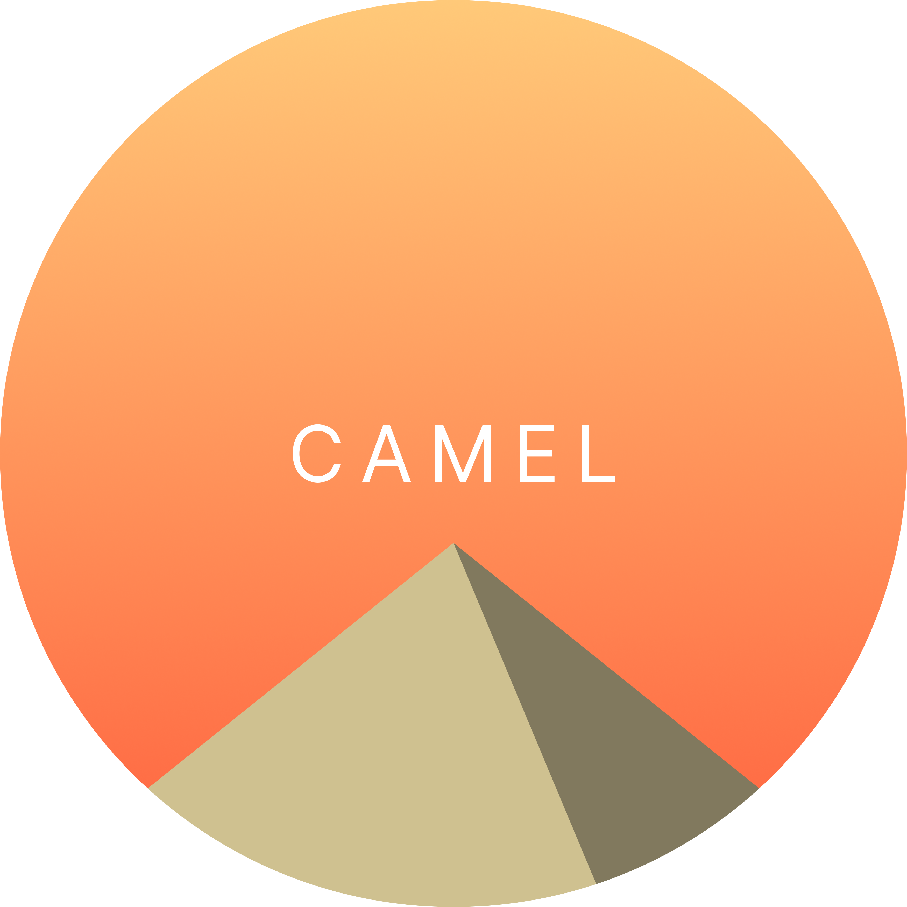

     
    
     
    <h3><b>CAMEL</b></h3>
    
<b>C</b>ode <b>A</b>nd <b>M</b>athematical <b>E</b>xpression <b>L</b>anguage

     

## 📦 ダウンロード ／ Download
<ul>
    <li>
        <a href="https://github.com/gamma-410/CAMEL/archive/refs/heads/main.zip">CAMEL (Download)</a>
    </li>
</ul>

## 📕 文法 ／ Grammar
<ul>
    <li>
        <a href="ja.grammar.md">日本語</a>  
    </li>
    <li>
        <a href="en.grammar.md">English</a>
    </li>
</ul>

## 🌹 ライセンス ／ License
<ul>
    <li>
        <a href="LICENSE">Apache License</a>
    </li>
</ul>
